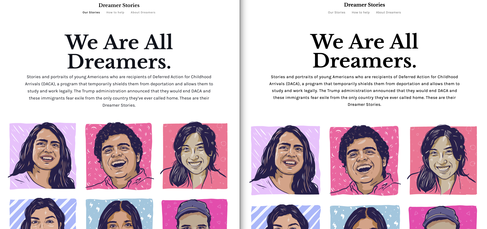
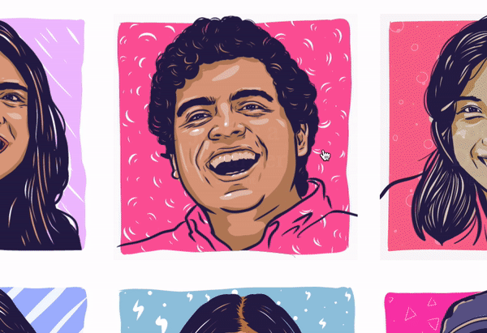

# HTML & CSS Webpage Clone Project
This project clones an existing webpage: https://www.dreamerstories.com



The actual site is on the left.

## Features:
- Hover techniques:
    - font changing colors
    - box appears
    - text scrolls into view
    - image zooms
- Grid use:
    - images on grid
    - padding adjusted
    - dynamic (images change # of columns upon adjustment of screen size)
- Use of Relative Position:
    - text is relative to images
    - background of text is also relative to images
- Menus:
    - menus are lists with links
    - overriding menu defaults to create modern look
- Classes:
    - classes used to define font-family clearly and quickly
    - classes used to separate text with different font size on images
    - classes used to group images into grid
    - classes used to create margins
- Font use:
    - referencing multiple google fonts in one line on html


Upon hover, the text changes to a darker color.



This shows the hover feature. The image zooms within the box created, gets covered by a low opacity gray box, and the text moves into the center of the image.


This demonstrates the dynamic properties of the site. As the screen size is reduced, the number of columns is also reduced.


## Problems faced:
- Getting text to scroll into view and be centered on image
    - Key points: 
        - set initial opacity to 0 and the hover opacity to 1
        - have the class containing the text match the width and height of the parent image 
        - have the top and left positions declared at 50% to center the text
        - be sure to adjust for the size of the text by using: 
        ```css
        transform: translate(-50%, -50%)
        ```
        - to move text up, use: 
        ```css
        transform: translateX(-50%) 
        ```
- Getting the image to zoom adn preventing the zoomed image from being visable outside of the original box size:
    - on hover, have the image scale up using 
    ```css
    transform: scale(1.1)
    ```
    - I used the overflow: hidden to prevent image from being visable outside of the original box size
- Making everything move smoothly
    - on every element that moved to keep transitions from appearing jumpy
    ```css
    transition: .5s ease
    ```
- Getting the grid styled properly: I wanted 3 columns of images unless the screen was smaller, then I would transition down to 2 and then 1 column
    - Within the grid element protperty to reduce the number of columns as the screen shrunk:
        ```css
        grid-template-columns: repeat(auto-fit, minmax(280px, 1fr))
        ```
    - Using a media query to prevent more than three columns as the screen grew:
        ```css
        @media only screen and (min-width: 780px) {
            .paragraph {
                padding: 60px 130px 20px;
            }
            .main-section {
                grid-template-columns: repeat(3, 1fr);
            }
        }

        ```

